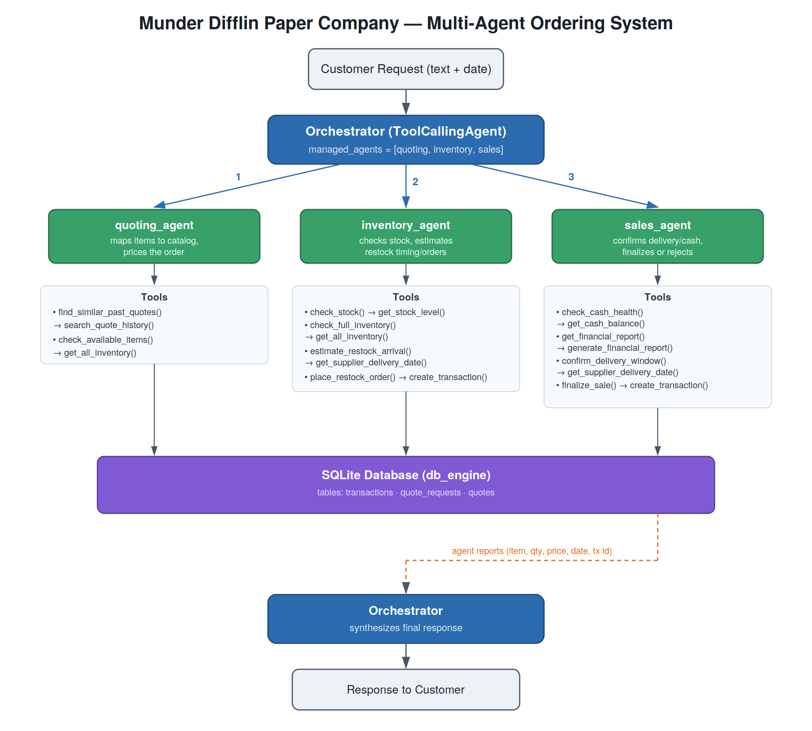

# Munder Difflin Multi-Agent Ordering System

A multi-agent system that handles customer paper-supply orders for a fictional company, Munder Difflin. Given a free-text customer request, it checks stock, prices the order, checks delivery timing and cash, and then finalizes or rejects the sale. Built with `smolagents` for the Udacity Agentic AI Nanodegree capstone.



## How it works

An orchestrator (`ToolCallingAgent`) delegates each request to three specialist agents. All agents use `gpt-4o-mini` and talk to a shared SQLite database through tools.

| Agent | Job | Tools |
|---|---|---|
| `quoting_agent` | Maps free-text items to catalog names, checks past quotes, prices the order | `find_similar_past_quotes`, `check_available_items` |
| `inventory_agent` | Checks stock, estimates supplier delivery, places restock orders | `check_stock`, `check_full_inventory`, `estimate_restock_arrival`, `place_restock_order` |
| `sales_agent` | Checks delivery window and cash, then finalizes or rejects | `check_cash_health`, `get_financial_report`, `confirm_delivery_window`, `finalize_sale` |

The tools wrap the helper functions supplied with the course (`create_transaction`, `get_all_inventory`, `get_stock_level`, `get_supplier_delivery_date`, `get_cash_balance`, `generate_financial_report`, `search_quote_history`). The agent code is in the "YOUR MULTI AGENT STARTS HERE" section of `project_starter.py`.

## Run it

```bash
pip install -r requirements.txt
cp .env.example .env        # then put your key in .env
python project_starter.py
```

The script rebuilds the database, runs the 20 requests in `quote_requests_sample.csv` in date order, prints each response with the updated cash and inventory, and writes `test_results.csv`.

The model is configured for the course's OpenAI-compatible proxy (`https://openai.vocareum.com/v1`, key variable `UDACITY_OPENAI_API_KEY`). To use OpenAI directly, change `api_base` and the key name in `project_starter.py`.

The data files (`quotes.csv`, `quote_requests.csv`, `quote_requests_sample.csv`) come from the course and are not included in this repository. Put them next to `project_starter.py` before running.

## Results and known limitations

On the 20 sample requests the system produces both finalized and rejected orders; rejections come from insufficient stock, deliveries that would arrive after the deadline, and low cash.

Testing showed a real weakness: the agents pass prices, dates and transaction IDs to each other as free text. In early runs this produced wrong totals, a date in the wrong year, and sales reported as successful with a $0.00 price. Adding explicit rules to each agent's instructions (quote tool output verbatim, never finalize at $0.00, include the transaction ID in any success claim) removed most of these, but prompts alone cannot guarantee that every number in a response came from a tool call.

`reconcile.py` is the check for that. After a run, it reads `test_results.csv`, finds the transaction IDs quoted in each response, and compares them with the `transactions` table (does the ID exist, is it a sale, does the price match). Run it right after a test run, because the database is rebuilt every time.

```bash
python project_starter.py
python reconcile.py test_results.csv munder_difflin.db
```

The full write-up, including suggested improvements (structured hand-offs between agents, schema validation of final answers), is in [docs/reflection.md](docs/reflection.md).

## Repository contents

- `project_starter.py` — database helpers, tools, agents, test runner
- `reconcile.py` — compares agent claims with the database
- `docs/` — architecture diagram (PNG and SVG) and reflection report
- `requirements.txt`, `.env.example`, `.gitignore`
